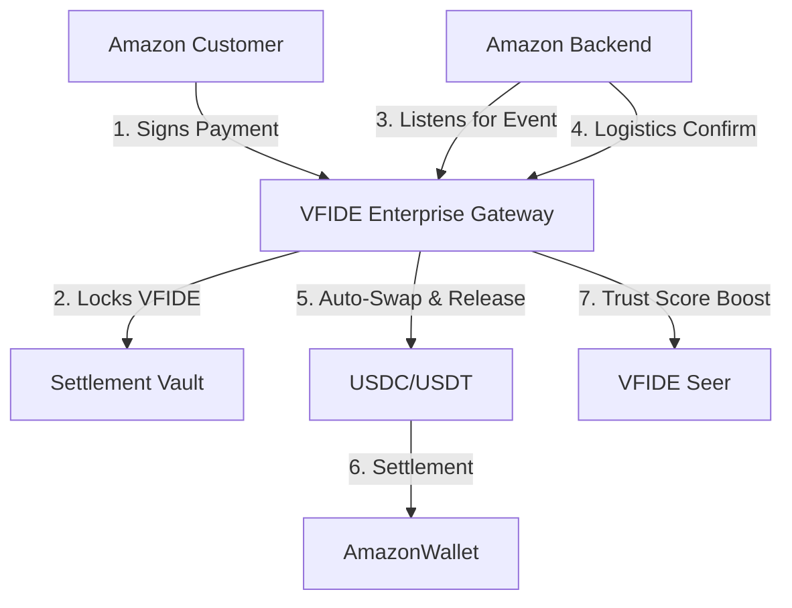

# Strategy: Integrating VFIDE with Amazon (Enterprise E-Commerce)

To achieve adoption by a giant like Amazon, VFIDE must bridge the gap between **Decentralized Trust** and **Centralized Efficiency**. Amazon requires instant finality, price stability, and programmatic control.

## The Core Problem
The current `VFIDECommerce` contract is designed for **Peer-to-Peer (P2P)** trust (Buyer releases funds).
Amazon operates on **B2C (Business-to-Consumer)** trust. They do not wait for a buyer to confirm receipt; they rely on their own logistics data.

## The Solution: VFIDE Enterprise Gateway
We propose building a dedicated smart contract layer (`VFIDEEnterpriseGateway.sol`) that acts as a translation layer between Amazon's API and the VFIDE Blockchain.

### 1. Architecture Overview

### 2. Key Technical Features

#### A. Oracle-Driven Settlement
Instead of the Buyer releasing funds, an **Authorized Oracle** (controlled by Amazon's API key) triggers the release upon "Delivered" status.
*   **Benefit**: Amazon retains control over the fulfillment lifecycle.

#### B. Real-Time Fiat Peg & Auto-Liquidation
Amazon prices in USD. The Gateway must:
1.  Fetch real-time VFIDE/USD price.
2.  Lock the exact amount of VFIDE.
3.  (Optional) Atomically swap VFIDE -> Stablecoin via a DEX Router (Uniswap) upon release.
*   **Benefit**: Amazon takes zero volatility risk.

#### C. Gasless Payments (EIP-2612)
Users shouldn't need ETH to pay gas. We implement **Meta-Transactions**.
1.  User signs a message "Pay 50 VFIDE for Order #123".
2.  Amazon's Relayer submits the transaction to the blockchain and pays the gas.
3.  The Gateway refunds Amazon's gas costs from the transaction amount.
*   **Benefit**: Seamless UX. The user just clicks "Pay".

#### D. "Verified Spender" Trust Mining
Purchasing on Amazon is a high-trust signal.
*   **Integration**: Every completed Amazon order calls `Seer.reward(user, points)` to boost the user's Trust Score.
*   **Incentive**: Users *want* to pay with VFIDE to increase their reputation in the DAO.

### 3. Implementation Roadmap

1.  **Phase 1: The Gateway Contract**
    *   Develop `VFIDEEnterpriseGateway.sol`.
    *   Implement `createOrder`, `settleOrder` (Oracle only), `refundOrder`.
    *   Integrate with `Seer` for reputation rewards.

2.  **Phase 2: The Oracle Mock**
    *   Build a script simulating Amazon's backend listening to blockchain events and triggering settlement.

3.  **Phase 3: The "Pay with VFIDE" Button**
    *   A frontend widget that generates the EIP-712 signature for the user.

## Next Steps
We should begin by implementing **Phase 1: The VFIDE Enterprise Gateway**. This proves to Amazon (and other enterprises) that we have the infrastructure to handle their specific needs.
